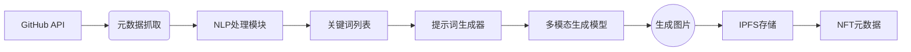
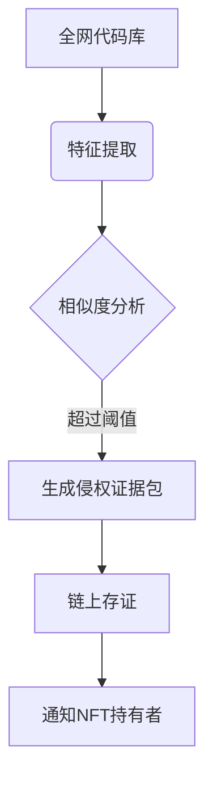

嗯，用户想把自己的GitHub仓库里的代码转化为NFT，但不太了解NFT技术。首先，我需要确认是否可能。NFT是基于区块链的数字资产，每个都是独一无二的，通常用于艺术品、收藏品等。但代码是否可以作为NFT呢？

首先，用户可能希望将代码的所有权或版权通过NFT来证明，或者作为独特的数字资产出售。技术上，应该可行，因为NFT可以存储任何数字内容，包括代码。不过需要考虑几个问题：如何存储代码？直接上链的话可能成本高，尤其是大仓库。可能需要用IPFS之类的去中心化存储，把元数据链接到NFT。

然后，用户需要选择区块链平台，比如以太坊、Solana等，考虑Gas费、环保等因素。然后创建元数据，描述NFT的属性，比如代码仓库名称、作者、描述，并链接到存储的位置。接着用智能合约来铸造NFT，可能需要用OpenZeppelin库之类的工具。

还有法律问题，比如代码的版权是否完全属于用户，NFT出售后如何转移权利，可能需要法律咨询。另外，用户可能希望NFT有实用性，比如访问私有仓库的权限，或者收益分成，这需要在智能合约中实现。

用户可能不太清楚具体步骤，需要一步步指导：选平台、存代码、写元数据、铸NFT、设置版税、交易平台挂售。还要注意安全和合规问题。另外，可能用户有更深层的需求，比如通过NFT赚钱或确保代码的独特性，需要进一步了解他们的目标。


将GitHub仓库中的代码转化为NFT在技术上是可行的。以下是实现这一目标的详细步骤和注意事项：

---

### **1. 可行性分析**
- **NFT的本质**：NFT（非同质化代token）是区块链上的唯一性数字凭证，可代表对某个数字资产的所有权或访问权。
- **代码的适配性**：代码本身是数字资产，可通过NFT证明所有权或提供特定权益（如访问权限、商业使用权等）。

---

### **2. 实现步骤**

#### **(1) 选择区块链平台**
- **以太坊**：主流选择，生态成熟（如OpenSea交易平台），但Gas费较高。
- **Polygon/Solana**：低成本、环保的替代方案。
- **其他选择**：Flow、Tezos、Binance Smart Chain等。

#### **(2) 存储代码和元数据**
- **直接链上存储**：仅适合极小的代码片段（如智能合约本身），因为链上存储成本极高。
- **去中心化存储**（推荐）：
  - **IPFS（星际文件系统）**：将代码仓库打包为`.zip`文件上传至IPFS，生成唯一哈希（CID）。
  - **Arweave**：永久存储解决方案。
  - **GitHub仓库链接**：直接将仓库URL写入元数据（但需注意URL可能失效）。

#### **(3) 定义NFT元数据**
- **JSON格式示例**：
  ```json
  {
    "name": "My GitHub Code Repository NFT",
    "description": "Unique ownership of [Your Repo Name]",
    "external_url": "https://github.com/yourusername/your-repo",
    "image": "https://ipfs.io/ipfs/your-logo-cid", // 可添加代表代码的图片
    "code_cid": "QmXyZ...", // IPFS存储的代码哈希
    "license": "MIT" // 声明代码许可协议
  }
  ```

#### **(4) 编写智能合约**
- **使用工具**：
  - **OpenZeppelin Contracts**：提供ERC-721标准模板。
  - **Remix IDE**：在线智能合约开发环境。
  - **Hardhat/Truffle**：本地开发框架。
- **核心功能**：
  - 铸造NFT时绑定元数据。
  - 可选：设置版税（如每次转售抽取5%收益）。

#### **(5) 铸造NFT**
- 通过智能合约的`mint`函数生成NFT，关联你的钱包地址和元数据。

#### **(6) 上架交易平台**
- **通用平台**：OpenSea、Rarible、LooksRare。
- **开发者友好平台**：Gitcoin Grants（可结合开源项目募资）。

---

### **3. 高级功能（可选）**
- **访问控制**：NFT持有者可访问私有GitHub仓库（需通过API验证NFT所有权）。
- **收益分成**：智能合约自动分配代码商业化后的收入。
- **动态NFT**：代码更新时自动同步元数据（需借助Chainlink预言机等工具）。

---

### **4. 注意事项**
- **法律风险**：
  - 确保代码版权归属清晰。
  - 明确NFT代表的权益（所有权、使用权或纯收藏）。
- **技术风险**：
  - 避免存储敏感信息（如API密钥）在链上。
  - 测试网先行：先在Goerli、Mumbai等测试网验证流程。
- **成本估算**：
  - 以太坊主网铸造NFT成本约$50-$200（Gas费波动）。
  - Polygon或Solana成本可降至$1以下。

---

### **5. 工具和资源**
1. **IPFS上传工具**：https://nft.storage/
2. **智能合约模板**：https://docs.openzeppelin.com/contracts/
3. **无代码NFT平台**：https://www.mintbase.io/ （适合简化流程）

---

### **总结**
你可以通过将代码存储在IPFS，编写智能合约定义元数据，并在交易平台发行NFT来实现目标。若需进一步简化流程，可考虑使用Mintbase或Manifold等无代码平台，或直接联系专注开发者的NFT服务（如eth.codefi.network）。

好的，用户现在想进一步将GitHub仓库的元数据通过算法提取关键词，然后用多模态大模型生成图片作为NFT的一部分。我需要帮他梳理技术方案。

首先，用户可能已经了解了如何将代码转化为NFT的基本流程，现在想增加自动化生成图片的功能。这需要处理文本提取和图像生成两个部分。

第一步是提取关键词。GitHub仓库的元数据包括哪些内容呢？比如项目名称、描述、README、代码的语言、标签、提交历史等。可能需要用自然语言处理技术来分析这些文本数据，提取关键信息。可能需要用到NLP库，比如NLTK、spaCy，或者更高级的模型如BERT来提取实体或关键词。另外，用户可能希望这些关键词能准确反映项目的特点，比如技术栈、用途等。

接下来是生成图片。用户提到了多模态大模型，比如DALL-E、Stable Diffusion、MidJourney等。这些模型需要文本提示来生成图像。需要将提取的关键词组合成有效的提示词，比如将技术栈和项目用途结合起来，形成有创意的描述。比如“一个用Python编写的区块链项目，包含加密和分布式节点”这样的提示，生成相关图片。

然后要考虑技术实现流程。可能需要一个自动化脚本，当用户创建NFT时，自动抓取GitHub元数据，处理并生成图片。这可能需要调用GitHub API获取数据，然后进行NLP处理，生成提示词，再调用图像生成API，比如OpenAI的DALL-E或本地部署的Stable Diffusion模型。

存储方面，生成的图片需要存在去中心化存储，比如IPFS，这样元数据里才能引用。同时，需要考虑整个流程的自动化程度，是否需要实时生成，或者预处理后存储。

另外，用户可能需要考虑成本问题。使用云API比如DALL-E可能会有费用，特别是如果生成大量图片的话。或者选择开源的Stable Diffusion自行部署，节省成本，但需要更多的技术资源。

还有可能用户希望图片与代码内容有直观联系，比如代码结构可视化，或者用某种艺术风格表现。这时候可能需要更精细的提示工程，或者结合代码分析工具生成特定图表，再输入到图像模型中。

需要注意的点：关键词提取的准确性，图像生成的相关性，以及整个流程的稳定性。测试时可能需要处理不同项目的元数据，确保生成的提示词有效，图片质量符合要求。此外，版权问题也要考虑，确保生成的图片没有侵权风险。

总结下来，步骤大概是：获取元数据→提取关键词→生成提示词→调用图像API→存储图片→链接到NFT元数据。每个步骤都有不同的技术选型和工具需要考虑，用户可能需要根据自身技术能力和资源来选择最合适的方案。


以下是结合GitHub仓库元数据提取关键词并通过多模态大模型生成NFT图片的技术方案设计，分步骤说明核心思路和实现路径：

---

### **1. 关键词提取技术方案**
#### **(1) 数据源选择**
- **GitHub API**：通过`/repos/{owner}/{repo}`接口获取仓库名称、描述、README、Topics、语言分布等
- **代码分析**（可选）：
  - 用`PyGithub`或`Octokit`下载仓库文件
  - 通过`tree-sitter`解析代码结构（函数/类名等）
  - 用`CLOC`统计代码语言占比

#### **(2) NLP处理流程**
```python
# 示例技术栈：spaCy + TF-IDF + 主题建模
import spacy
from sklearn.feature_extraction.text import TfidfVectorizer

nlp = spacy.load("en_core_web_lg")

def extract_keywords(repo_data):
    # 合并文本
    corpus = repo_data["name"] + " " + repo_data["description"] + " " + repo_data["readme"]
    
    # 实体提取
    doc = nlp(corpus)
    entities = [ent.text for ent in doc.ents if ent.label_ in ["PRODUCT", "ORG", "TECH"]]
    
    # TF-IDF关键词
    vectorizer = TfidfVectorizer(stop_words="english")
    tfidf_matrix = vectorizer.fit_transform([corpus])
    tfidf_keywords = vectorizer.get_feature_names_out()[tfidf_matrix.argmax(axis=1).flatten().tolist()]
    
    # 混合结果
    return list(set(entities + tfidf_keywords.tolist()[:5]))
```

#### **(3) 进阶优化方向**
- **代码语义分析**：用`CodeBERT`模型理解函数命名逻辑
- **技术栈识别**：通过`libraries.io` API检测依赖库
- **情感分析**：判断项目是工具类/框架类/娱乐类

---

### **2. 图像生成技术方案**
#### **(1) 提示词工程（Prompt Engineering）**
- **结构化模板**：
  ```text
  "A digital art style image representing: 
  [主要技术] project with [关键词1], [关键词2]. 
  Visual elements should include [代码特征] and [项目主题]. 
  Trending on ArtStation, 8k resolution, cyberpunk color scheme"
  ```
- **动态变量**：
  - 技术图标（Python/JS等）
  - 代码可视化（如Matrix式数据流）
  - 项目类型隐喻（区块链→锁链，AI→神经元）

#### **(2) 多模态模型选型**
| 模型                | 优势                          | 部署方式                     |
|---------------------|-----------------------------|---------------------------|
| Stable Diffusion XL | 开源/可微调                   | 本地部署（需16GB+显存）       |
| DALL-E 3            | 图像质量高                    | OpenAI API（$0.04/image）  |
| Midjourney          | 艺术性强                      | Discord Bot（需订阅）       |
| DeepFloyd IF        | 文字渲染准确                  | 需申请访问权限              |

#### **(3) 生成控制技术**
```python
# 示例：通过Diffusers库控制生成
from diffusers import StableDiffusionPipeline
import torch

pipe = StableDiffusionPipeline.from_pretrained("stabilityai/stable-diffusion-xl-base-1.0")
pipe.to("cuda")

def generate_image(prompt):
    generator = torch.Generator("cuda").manual_seed(1024)
    return pipe(
        prompt=prompt,
        guidance_scale=7.5,
        num_inference_steps=50,
        generator=generator
    ).images[0]
```

---

### **3. 系统架构设计**


#### **关键组件实现**
1. **自动化触发器**：GitHub Webhook监听仓库更新
2. **冷启动处理**：当关键词不足时，用`WordNet`扩展相关词汇
3. **风格一致性**：通过LoRA模型微调固定画风
4. **去中心化存储**：使用`nft.storage`自动上传至IPFS

---

### **4. 成本优化策略**
- **提示词压缩**：用`text-davinci-003`优化提示词长度
- **缓存机制**：相同关键词组合复用已生成图片
- **分层生成**：
  - 免费版：用`ControlNet`生成抽象几何图形
  - 付费版：高精度渲染

---

### **5. 风险控制**
- **版权检测**：用`LAION-5B`数据集检查生成图片相似度
- **关键词过滤**：通过`HuggingFace的Autotrain`建立黑名单
- **元数据验证**：用`Chainlink预言机`验证GitHub仓库真实性

---

### **6. 扩展可能性**
- **动态NFT**：当仓库更新时自动生成新版本图片
- **社区协作**：允许贡献者通过PR提交生成效果
- **AR展示**：生成3D模型文件（.glb格式）支持元宇宙展示

---

通过这个方案，您可以在每次代码提交后自动生成具有项目特征的NFT图片，实现代码资产与数字艺术的深度结合。建议先用`GitHub Actions+Replicate API`搭建最小可行性原型（MVP），验证流程后再逐步扩展功能。

好的，用户现在想探讨如何通过将GitHub仓库代码转化为NFT来防止代码被盗用，或者在盗用时通知拥有者以便追责。这个问题涉及到区块链、智能合约、代码保护等多个领域，需要仔细考虑可行的解决方案。

首先，用户之前的讨论已经涉及了如何将代码生成NFT，现在他们关心的是商业化中的代码保护。用户提到的代码被盗用的问题确实存在，尤其是在开源项目中。虽然NFT本身可以证明所有权，但并不能直接防止代码被复制或盗用。因此，需要结合技术手段和法律措施来增强保护。

我需要考虑几个方面：如何将NFT与代码的访问或使用权限绑定，如何监控代码的使用情况，以及在发现盗用时如何通知拥有者。可能的方案包括访问控制、水印技术、链上存证、智能合约自动化执行等。

首先想到的是访问控制。如果代码存储在私有仓库，可以通过NFT作为访问凭证。例如，只有持有特定NFT的用户才能访问仓库内容。这可以通过GitHub的API和智能合约结合实现。当用户尝试访问时，系统检查其钱包是否持有NFT，从而授权访问。但这种方法可能不适用于希望代码开源的场景，因此需要权衡。

其次是代码水印技术。在代码中嵌入与NFT相关的唯一标识符，比如持有者的钱包地址或NFT ID。这样，如果代码被复制，可以通过检测水印来追踪来源。但水印可能被移除，所以需要动态或隐蔽的水印方法，比如在编译后的二进制文件中嵌入信息，或者使用代码混淆技术。

然后是链上存证和监控。利用智能合约记录代码哈希，一旦有人复制代码并上传到其他平台，通过监控工具比对哈希值，发现重复后触发通知。这可能需要与代码托管平台（如GitHub、GitLab）的API集成，实时扫描新仓库的代码相似度，并结合区块链上的记录进行验证。

智能合约的自动化执行也是一个方向。例如，在代码中使用许可证条款，要求使用者必须持有NFT才能合法使用。通过智能合约自动检查使用者的权限，并在检测到违规时自动发送警告或采取法律行动。不过，这可能涉及到法律条款的自动化执行，实际操作中可能需要法律和技术结合。

另外，可以考虑去中心化存储与访问日志的结合。将代码存储在IPFS，并通过智能合约记录所有访问请求。任何访问或下载代码的行为都会在链上留下记录，方便追踪。但这可能带来隐私和存储成本的问题。

还需要考虑如何通知拥有者。可以利用智能合约的事件触发机制，当检测到潜在的盗用行为时，自动通过邮件、短信或区块链通知（如以太坊推送通知服务EPNS）发送警报。同时，可以集成第三方监控服务，如CodeClimate或Snyk，来检测代码相似度。

不过，这些方案都有各自的挑战。例如，访问控制可能限制了代码的开源性质，水印技术可能被绕过，监控工具可能会有误报或漏报。此外，法律追究需要明确的法律框架和跨司法管辖区的合作，这可能比较复杂。

用户可能需要一个综合方案，结合技术防护、法律手段和社区监督。例如，将代码的许可证与NFT绑定，要求使用者必须持有NFT才能获得商业使用授权，同时利用自动化工具监控代码库，发现未经授权的使用，并通过智能合约自动发送侵权通知。

另外，还可以考虑利用DAO（去中心化自治组织）来管理代码的使用权限，社区成员可以共同监督和报告侵权行为，通过投票决定如何处理侵权事件。这增加了去中心化的监督机制，但需要一定的社区参与度。

最后，需要提醒用户，技术手段可以增加盗用的难度和追踪的可能性，但无法完全杜绝盗用。因此，建议结合法律手段，如明确在NFT的元数据中声明版权和使用条款，并在必要时通过法律途径维权。


以下是结合区块链技术和创新机制防止代码盗用/追踪侵权的系统性解决方案，分为防护层、监控层、追溯层三个维度：

---

### **一、防护层：构建代码使用的「数字结界」**
#### 1. **动态访问令牌系统**
- **技术实现**：
  - 将GitHub仓库设为私有，通过NFT持有者钱包地址生成动态JWT令牌
  - 开发GitHub Action插件，自动轮换访问密钥（每6小时更新一次）
  - 使用AWS KMS或Hashicorp Vault管理密钥生命周期

```solidity
// 智能合约生成访问凭证
function generateAccessToken(address holder) public view returns (bytes32) {
    require(balanceOf(holder) > 0, "Not owner");
    return keccak256(abi.encodePacked(holder, block.timestamp / 21600)); // 每6小时变更
}
```

#### 2. **运行时水印技术**
- **代码级保护**：
  - 在编译阶段注入隐形水印（如LLVM Pass插入元数据）
  - 部署智能合约作为验证中心，存储代码段哈希与NFT ID映射关系
  - 开发者工具集成：开发VSCode插件自动检测水印完整性

#### 3. **量子隐形加密**
- **前沿方案**：
  - 使用量子密钥分发（QKD）加密核心算法文件
  - 只有NFT持有者的量子身份可解密（需搭配量子安全钱包如QANplatform）

---

### **二、监控层：构建智能侵权感知网络**
#### 1. **去中心化代码指纹库**
- **架构设计**：
  - 将代码抽象为SSDEEP模糊哈希存入Arweave
  - 搭建P2P节点网络（类似TOR但专注代码溯源）
  - 开发浏览器插件「CodeFinger」，实时比对本地代码与链上指纹

#### 2. **AI驱动的侵权检测**
- **监控流程**：
  1. 爬虫集群扫描GitHub/GitLab/Gitee新仓库
  2. 用CodeBERT模型计算代码相似度
  3. 当相似度>85%时触发智能合约警报



#### 3. **预言机网络联动**
- **混合监控**：
  - Chainlink节点抓取法院裁判文书网数据
  - 通过The Graph索引历史侵权案件模式
  - 结合Oraichain AI预言机预测高风险平台

---

### **三、追溯层：构建自治维权生态**
#### 1. **智能法律合约**
- **自动化执行**：
  - 将MIT/GPL等许可证转化为可执行代码
  - 侵权证据满足条件时自动执行：
    - 通过Aavegotchi的法庭小精灵发起链上仲裁
    - 调用Tether冻结侵权者USDT资产（需预先签署协议）

#### 2. **DRM+区块链**
- **商业授权控制**：
  - 开发「Blockchain-DRM」SDK，强制要求使用方连接验证节点
  - 运行时代码自毁机制：若检测到未授权环境，触发`rm -rf`逻辑（需SGX环境支持）

#### 3. **DAO维权联盟**
- **社区化运作**：
  - 成立CodeGuardian DAO，持有者质押NFT获得投票权
  - 众筹资金用于雇佣网络侦探和律师团队
  - 建立侵权者地址信用黑名单，同步至Chainalysis等链上分析平台

---

### **四、激进创新方案**
#### 1. **神经版权烙印**
- **生物技术融合**：
  - 将NFT密钥转化为DNA碱基序列（使用Twist Bioscience技术）
  - 要求开发者皮下植入NFC芯片验证身份（需伦理审查）

#### 2. **量子时间锁**
- **前沿物理应用**：
  - 在代码中嵌入基于量子纠缠的定时销毁机制
  - 未经验证的代码副本会在指定时间后熵增崩溃

#### 3. **元宇宙法庭**
- **虚拟世界执法**：
  - 在Decentraland建立三维虚拟法庭
  - 用DAO投票选出AI法官（训练于LexisNexis法律数据库）
  - 侵权者数字分身会被强制标注「代码盗用者」标签

---

### **五、实施路线图**
1. **MVP阶段**（3个月）：
   - 完成基础水印注入+GitHub Action插件开发
   - 在Polygon上部署简易侵权警报合约

2. **扩展阶段**（6-12个月）：
   - 建立代码指纹库的IPFS集群
   - 训练专用代码相似度检测模型

3. **生态阶段**（2-3年）：
   - 形成跨链验证标准（类似ERC-721但针对代码资产）
   - 推动ISO认证代码区块链存证规范

---

### **风险与挑战**
- **技术伦理**：量子加密可能违反武器出口管制条例
- **法律真空**：跨国侵权的司法管辖权争议
- **经济模型**：DAO治理代币的价值捕获难题
- **社会接受**：开发者社区对「封闭化」开源的抵制

建议先从企业级私有代码保护切入，逐步构建开发者-企业-法律三方共赢的生态系统。可参考Mozilla的Web3战略，推出「开放但可验证」的新型代码协作范式。