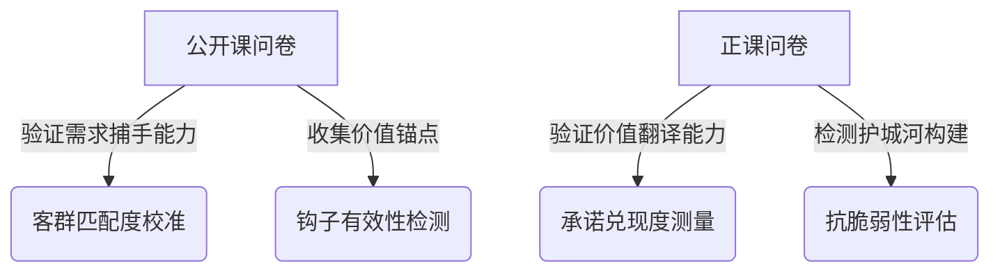
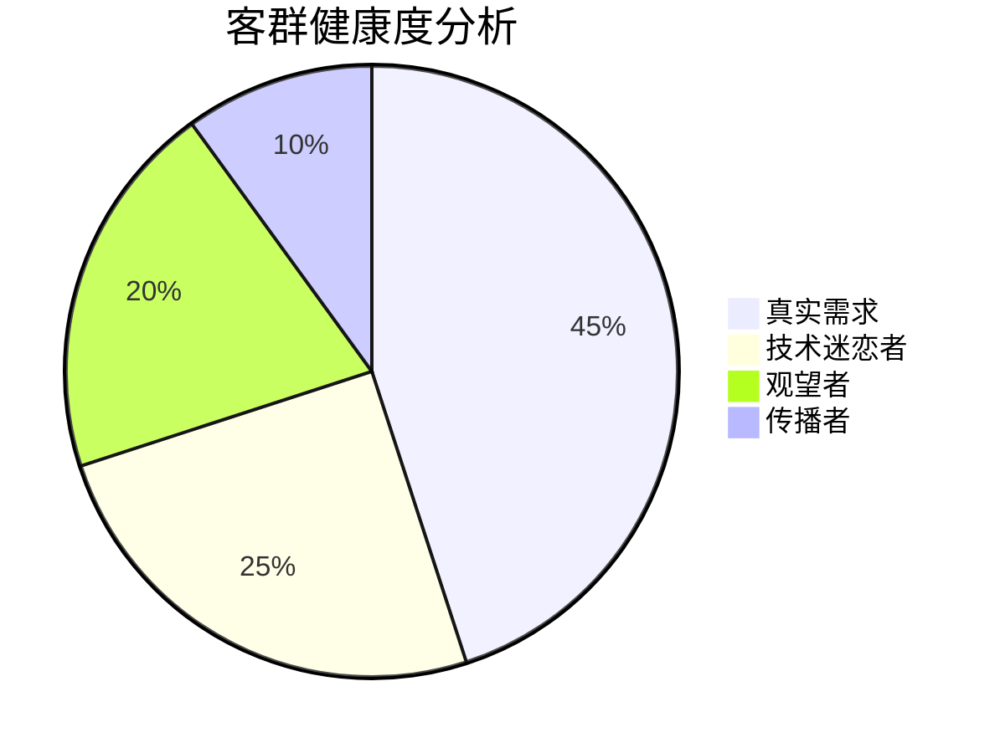
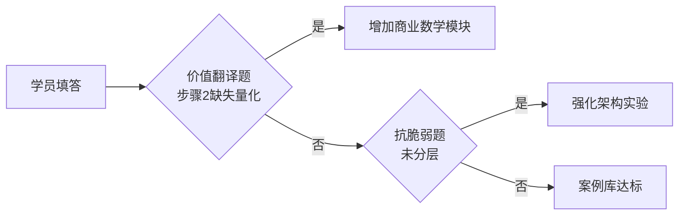
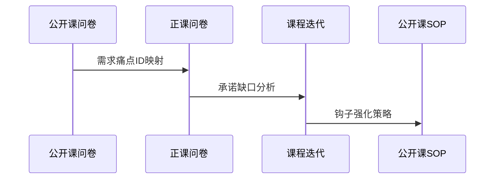

### 一、问卷分层设计原理（基于课程 SOP）



---

### 二、公开课问卷设计框架（Pre-Sale）

#### 1. 核心目标矩阵

| 维度       | 测量指标       | 课程关联点       |
| ---------- | -------------- | ---------------- |
| 客群匹配度 | 三类画像占比   | 课程定位校准     |
| 需求真实性 | 沉默成本量化值 | 需求降噪器验证   |
| 伪需求识别 | 技术迷恋指数   | 抗脆弱架构必要性 |
| 裂变可能性 | 社交资本储备值 | 推荐返现机制优化 |

##### 如何理解核心目标矩阵

用生活化的比喻来解释这个核心目标矩阵：

###### 客群匹配度 → "确认来的是不是对的人"

- **测量指标**：就像在菜市场统计有多少人是来买肉的（开发者）、买配菜的（产品经理）、开餐馆采购的（创业者）
- **课程关联**：如果发现来听课的都是家庭主妇（非目标群体），就得调整宣传策略，比如把广告从"菜谱大全"改成"餐饮创业指南"

###### 需求真实性 → "看看是真饿还是嘴馋"

- **测量指标**：计算学员已经为找吃的花了多少钱时间（比如连续 3 天没吃饭的人，比刚吃完下午茶的人需求更真实）
- **课程关联**：就像我们的"需求降噪器"是个智能饭点检测器，能过滤掉那些只是来闻香味的人

###### 伪需求识别 → "防止买椟还珠"

- **测量指标**：检查学员是想要珍珠（解决问题）还是沉迷收藏盒子（追求新技术）
- **课程关联**：就像教人做首饰，重点是用好材料（抗脆弱架构），而不是让人沉迷收集包装盒（最新技术）

###### 裂变可能性 → "找自带喇叭的学员"

- **测量指标**：发现那些在美食街有自己摊位的人（行业影响力者），他们尝过觉得好会主动帮吆喝
- **课程关联**：给这些摊主发优惠券（推荐返现），他们叫卖时能带来更多真实客户

**总结**：这就像开餐馆前要做四件事：

1. 确认门口排队的都是真来吃饭的（客群匹配）
2. 区分饿肚子的人和美食博主（需求真假）
3. 防止客人只拍照不点菜（伪需求）
4. 培养忠实老客当活广告（裂变传播）

#### 2. 关键问题设计（示例）

---

##### **公开课问卷关键问题设计（优化版）**

###### **一、客群匹配度验证**

**问题 1：您最近三个月主要在做的事情是？（单选）**  
[ ] 写代码调模型（开发者模式）  
[ ] 设计产品功能文档（产品经理模式）  
[ ] 跑客户谈合作（创业者模式）  
[ ] 学习基础知识（观望者模式）

**设计意图**：  
▸ 用行为模式替代职业标签，突破职位名称的模糊性  
▸ 第四选项作为"非目标客群"的过滤阀

---

###### **二、需求真实性验证**

**问题 2：您想解决的业务问题，已经让您付出过什么代价？（多选）**  
[ ] 团队 3 人月以上的开发时间  
[ ] 超过 5 万元的试错成本  
[ ] 客户投诉/退款等商誉损失  
[ ] 管理层施加的考核压力  
[ ] 暂时没有实际损失

**问题 3：如果这个问题不解决，半年内最可能发生什么？**  
[ ] 团队裁员缩编  
[ ] 客户流失竞品  
[ ] 个人晋升受阻  
[ ] 公司战略调整  
[ ] 不会有实质影响

**设计意图**：  
▸ 量化沉默成本的典型场景（时间/金钱/信誉）  
▸ 第三题检测需求紧迫性，与第二题形成交叉验证

---

###### **三、伪需求识别**

**问题 4：当您听到以下哪个消息最兴奋？（单选）**  
[ ] GPT-5 支持百万级上下文  
[ ] 客户愿意为现有方案付费  
[ ] 新框架代码量减少 80%  
[ ] 获得大厂 AI 技术认证

**问题 5：如果客户突然不需要 AI 功能，您会？（单选）**  
[ ] 立刻转向其他技术方向  
[ ] 说服客户理解 AI 价值  
[ ] 寻找新客户群体  
[ ] 本来就没想清楚

**设计意图**：  
▸ 第四题测量技术迷恋程度（选 A/C 为高风险）  
▸ 第五题检测价值锚点稳定性（选 B/C 为真实需求）

---

###### **四、裂变可能性预测**

**问题 6：您最常分享哪类内容到朋友圈？（单选）**  
[ ] 技术突破新闻  
[ ] 行业分析报告  
[ ] 成功案例成果  
[ ] 几乎不分享

**问题 7：如果课程让您收获超出预期，您会？（多选）**  
[ ] 主动推荐给团队  
[ ] 发社交媒体圈层  
[ ] 写成经验文章  
[ ] 私下告诉密友  
[ ] 自己消化不传播

**设计意图**：  
▸ 第六题测量社交资本类型（选 B/C 具备裂变基因）  
▸ 第七题设计为多选梯度，区分传播意愿强度

---

##### **防伪校验机制**

**镜像验证题组**：  
在问卷开头和结尾重复设置镜像问题，但更换表述方式：

**问题 A（开头）：您当前最需要提升的能力是？**  
[ ] 技术实现能力  
[ ] 需求分析能力  
[ ] 商业变现能力  
[ ] 资源整合能力

**问题 B（结尾）：哪些培训服务对您价值最低？**  
[ ] 前沿技术解析  
[ ] 客户沟通方法论  
[ ] ROI 计算模型  
[ ] 行业人脉对接

**校验逻辑**：  
▸ 若开头选 A 但结尾未选 A → 技术伪需求嫌疑  
▸ 开头选 C 但结尾选 C → 商业需求真实性高

---

##### **数据分析可视化建议**



**指标解释**：

- **技术迷恋者**：问题 4 选 A/C + 问题 5 选 A
- **传播者**：问题 6 选 B/C + 问题 7 选 A/B
- **真实需求**：问题 2 选 ≥2 项 + 问题 3 选 A/B/C

---

- 建议配合埋点技术捕捉答题时长（<90 秒的答卷视为低质量数据）
- 设置逻辑跳转（如问题 2 选 E 的直接结束问卷）。

---

### 三、正课问卷设计框架（Post-Sale）

#### 1. 核心验证维度

| 课程承诺点   | 测量方式                 | 改进关联           |
| ------------ | ------------------------ | ------------------ |
| 需求捕手能力 | 学员自建需求验证报告质量 | 案例库迭代方向     |
| 价值翻译能力 | 客户沟通话术转化率       | 方法论模块优化     |
| 抗脆弱架构   | 技术栈变更应对时间       | 实验环境配置更新   |
| 商业闭环验证 | 学员项目 ROI 计算模型    | 商业化模块案例补充 |

## 核心验证维度的解释：

##### 1. **需求捕手能力 → "教人精准找钥匙"**

- **测量方式**：检查学员是否能在钥匙堆里快速找到能开自家锁的那把（需求验证报告）
- **课程关联**：就像教开锁师傅，如果学员总拿错钥匙（找伪需求），说明教学案例库的锁具类型（行业案例）需要增加

---

##### 2. **价值翻译能力 → "当技术翻译官"**

- **测量方式**：看学员能不能把"芯片纳米工艺"翻译成"手机充电 5 分钟续航 5 小时"（话术转化）
- **课程关联**：如果客户听完还是不懂（低转化率），说明需要加强"技术 → 人话"的翻译训练模块

---

##### 3. **抗脆弱架构 → "造变形金刚战甲"**

- **测量方式**：突然要求战甲从陆地模式切换飞行模式（技术栈变更），记录变形耗时
- **课程关联**：如果学员需要 3 天改装（应对时间长），说明实验车间（开发环境）缺少快速换装训练装置

---

##### 4. **商业闭环验证 → "开餐馆算账能力"**

- **测量方式**：检查学员是否算清了：买菜成本 × 翻台率 - 房租水电 = 真实利润（ROI 模型）
- **课程关联**：如果总漏算食材损耗（计算模型缺陷），需要增加"餐饮店长特训"案例（商业化模块）

---

**比喻联动**：  
这就像培养一个特种部队：

1. 先教侦察兵找对目标（需求捕手）
2. 训练通讯员准确传令（价值翻译）
3. 配备适应各种地形的装备（抗脆弱）
4. 最后考核完成任务还带回战利品（商业闭环）

每个环节的考核结果直接指导教官（课程团队）调整训练方案。

### **正式课问卷优化设计（场景化版本）**

#### **一、价值翻译能力检测（进阶情境题）**

**场景**：客户说："我不关心什么 32k 上下文，只要告诉我这玩意能让我少赔多少钱？"  
请分步骤回应：

1. 技术参数解释（30 字内）：\_\_\_\_\_\_\_\_\_\_
2. 量化价值陈述（必须含%或金额）：\_\_\_\_\_\_\_\_\_\_
3. 应对质疑话术（使用类比）：\_\_\_\_\_\_\_\_\_\_

**评估维度**：  
▸ 能否剥离技术术语（步骤 1）  
▸ 是否建立量化传导公式（步骤 2）  
▸ 是否掌握类比翻译技巧（步骤 3）

**示例优秀答案**：

1. "能同时处理 300 页文档不丢信息"
2. "预计减少文档拆分次数，每月节约分析师 42 工时（约 2.1 万元）"
3. "就像给会计换了台验钞机，数钱又快又准不卡纸"

---

#### **二、抗脆弱架构验证（压力测试题）**

**事件**：客户要求将现有 GPT-4 方案切换为国产大模型，且需保证：

- 响应速度变化 ≤0.5 秒
- 输出格式兼容原有系统
- 3 周内上线

您的应对方案包含：  
[ ] 配置层参数调整（耗时：\_\_\_天）  
[ ] 适配层代码改写（涉及\_\_\_个模块）  
[ ] 数据层迁移方案（需处理\_\_\_GB 数据）  
[ ] 其他：\_\_\_\_\_\_\_\_\_\_

**评估标准**：  
▸ 是否采用分层架构（配置/适配/数据层分离）  
▸ 各层工作量预估合理性（课程基线：配置层 ≤1 天，适配层 ≤3 模块）  
▸ 风险预警意识（如数据格式转换陷阱）

---

#### **三、商业闭环验证（决策树题型）**

**已知条件**：

- 客户年度文档处理沉默成本：80 万元
- 痛感系数评估：7/10 分（法务部频繁加班投诉）
- 替代方案：外包处理，报价 65 万元/年

**问题**：

1. 计算客户支付意愿阈值：\_\_\_\_万元
2. 您的报价策略应是：  
   [ ] ≤30 万（低价获客）  
   [ ] 31-50 万（成本加成）  
   [ ] 51-70 万（价值定价）  
   [ ] ≥71 万（溢价定位）
3. 可能被客户挑战的风险点：\_\_\_\_（至少 2 个）

**参考答案**：

1. 80×0.7/(65/80)=68.9 万（应用课程公式）
2. 选 C（价值锚定在替代方案节约空间）
3. 实际痛感被高估/外包服务质量不可控

---

#### **四、需求捕手能力（案例分析题）**

**背景**：某学员提出开发"智能合同风险扫描系统"

请用课程框架评估：

1. 需求真实性信号：\_\_\_\_（如：法务部现存错漏率数据）
2. 需验证的三个关键指标：
   - 沉默成本凭证：\_\_\_\_
   - 支付能力证据：\_\_\_\_
   - 决策链共识度：\_\_\_\_
3. 最大风险点预判：\_\_\_\_

**课程方法论映射**：  
▸ 是否调用需求降噪器的四维矩阵  
▸ 能否识别"法务部 vs 财务部"的沉默成本认知差异

---

### **改进关联强化机制**



### **设计创新点**

1. **场景浸入式问题**：模拟真实客户对话压力，超越单纯知识点回忆
2. **决策树建模**：要求应用课程公式处理多变量现实场景
3. **架构可视化拆解**：通过分层工作量评估设计合理性
4. **风险预警训练**：在成功案例中主动寻找潜在破绽

### 四、跨周期联动机制

#### 1. 用户旅程闭环验证



#### 2. 关键联动指标

- **需求 ID 留存率**：公开课收集的痛点在被正课学员实际解决的比例
- **沉默成本预测准确率**：学员实际商业损失 vs 公开课问卷自估值的差异
- **架构认知迁移度**：抗脆弱相关问题的正确率提升幅度

#### 3. 防作弊体系

- 在公开课问卷植入**技术悖论题**（所有选项均错误的选择题）
- 使用**文字题语义分析**检测复制粘贴行为
- 设置**时间陷阱**（快速完成的问卷标记为低质量）

---

### 五、执行建议

1. **公开课问卷投放策略**

   - 在公开课报名页设置**阶梯式解锁**：完成问卷获得进阶版本的资料
   - 嵌入**实时画像生成**功能：填写后立即显示"您的开发者类型诊断报告"

2. **正课问卷激励机制**

   - 结合学员问卷结果生成**抗脆弱能力证书**
   - 对高完成度问卷开放**导师 1v1 商业诊断**特权

3. **数据分析看板**  
   建议开发双视图看板：
   
   ```
   [公开课视图] [正课视图]
   ├─ 伪需求雷达图 ├─ 承诺兑现热力图
   ├─ 沉默成本分布 ├─ 架构认知进展
   └─ 裂变基因库 └─ 商业闭环率
   ```
