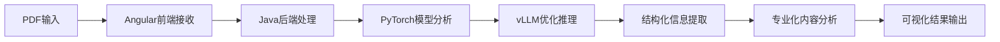

# 技术对比演示方案

## 演示目标
通过同一论文的不同处理方式对比，直观展示系统化方法相比单一工具的优势，让学员"一眼看出差别"。

## 技术栈基础
**我们的实际技术架构**：
- **后端**：Java（企业级稳定性、高并发处理）
- **前端**：Angular（现代化交互界面、用户体验优化）
- **AI引擎**：PyTorch（深度学习模型训练与推理）
- **推理优化**：vLLM（高效大模型推理、资源优化）

## 对比演示设计

### 1. 演示场景设置
```markdown
📄 输入材料：同一篇学术论文PDF
🎯 处理目标：生成论文导读报告
⚖️ 对比对象：
  - 通用AI工具（ChatGPT/Claude）
  - 基于系统化架构设计的系统
```

### 2. 对比维度设计

#### A. 输出结构对比
**通用AI工具输出**：
```
论文标题：[标题]
这篇论文主要讨论了...接下来分析了...作者提出了...
实验结果显示...总的来说...这篇论文的贡献在于...
（段落式、散乱的文字描述）
```

**基于系统化架构设计的系统输出**：
```
📋 论文信息卡片
├── 基本信息（标题、作者、期刊、时间）
├── 核心贡献（3-5个关键点，结构化展示）
├── 技术方法（方法论、算法、架构）
├── 实验验证（数据集、评估指标、结果分析）
├── 创新点分析（与现有方法的差异、优势）
├── 应用前景（实际应用场景、商业价值）
└── 相关工作（引用关系、发展脉络）
```

#### B. 专业性深度对比
**通用AI表现**：
- 术语解释：表面化、词典式解释
- 技术理解：基础概念层面
- 关联分析：缺乏领域专业关联

**系统化方法表现**：
- 术语解释：结合领域上下文的深度解析
- 技术理解：方法原理、适用场景、局限性
- 关联分析：与该领域其他技术的关系图谱

#### C. 信息完整性对比
**通用AI局限**：
- 可能遗漏关键技术细节
- 数学公式处理能力有限
- 图表信息提取不完整

**系统化优势**：
- 多模态信息提取（文本+图表+公式）
- 结构化数据处理
- 信息验证与交叉检查

### 3. 现场演示流程

#### 准备阶段（5分钟）
1. **论文选择**：
   - 准备2-3篇不同领域的经典论文
   - 优先选择有清晰结构、图表丰富的论文
   - 可接受学员现场提供的论文

2. **演示环境**：
   - 两个屏幕/窗口并排显示
   - 左侧：通用AI工具界面
   - 右侧：基于系统化架构设计的系统界面

#### 执行阶段（15分钟）
1. **同步输入**（2分钟）
   - 将同一PDF同时上传到两个系统
   - 提出相同的分析要求

2. **处理过程展示**（3分钟）
   - 通用AI：简单的文本处理过程
   - 系统化架构系统：展示系统化处理流程

3. **结果对比**（10分钟）
   - 并排展示两种输出结果
   - 逐一对比各个维度的差异
   - 重点突出结构化、专业性、完整性差异

### 4. 关键差异点强调

#### 可视化差异
```markdown
通用AI输出 ❌          系统化架构系统 ✅
--------------------------------
文字墙式输出      →     结构化卡片展示
泛泛而谈         →     专业深度分析  
信息零散         →     逻辑关联清晰
单一维度         →     多维度全面分析
静态文本         →     交互式界面
```

#### 专业性体现
- **术语处理**：从词典解释到领域专业解析
- **方法理解**：从概念描述到原理剖析
- **价值评估**：从主观评价到客观分析框架

#### 实用性优势
- **可操作性**：结构化输出便于进一步处理
- **可扩展性**：系统可根据需求定制化
- **可靠性**：企业级技术栈保证稳定性

### 5. 技术实现要点

#### 系统化处理流程


#### 核心技术优势
1. **Java后端**：
   - 企业级并发处理能力
   - 稳定的文件处理和数据管理
   - 强大的集成和扩展能力

2. **Angular前端**：
   - 现代化用户界面
   - 实时交互和结果展示
   - 响应式设计，多设备适配

3. **PyTorch+vLLM**：
   - 灵活的模型训练和部署
   - 高效的大模型推理
   - 可定制的专业化处理

### 6. 演示效果预期

#### 学员感受
- **直观对比**：一眼看出质量差异
- **专业认知**：理解系统化方法的价值
- **技术兴趣**：激发对完整技术栈的学习动机

#### 转化效果
- **技术价值认同**：认识到系统化开发的优势
- **学习需求激发**：希望掌握完整技术栈
- **商业价值理解**：看到专业化工具的市场机会
- **预期转化率**：调整至5%的合理目标

## 风险控制与应急方案

### 潜在风险
1. **网络延迟**：演示过程中网络问题影响效果
2. **论文选择**：某些论文可能不适合对比演示
3. **系统故障**：技术故障影响演示效果

### 应急预案
1. **备用论文**：准备多篇不同类型的示例论文
2. **离线演示**：预先准备好的结果对比截图
3. **录屏备份**：提前录制好的演示视频作为备选

## 总结

这种对比演示方案的核心优势：
- **真实性**：使用实际的技术栈和系统
- **直观性**：差异明显，学员容易理解
- **专业性**：体现出系统化方法的技术价值
- **可信度**：基于实际能力，避免夸大宣传
- **目标务实**：5%转化率更符合实际预期 