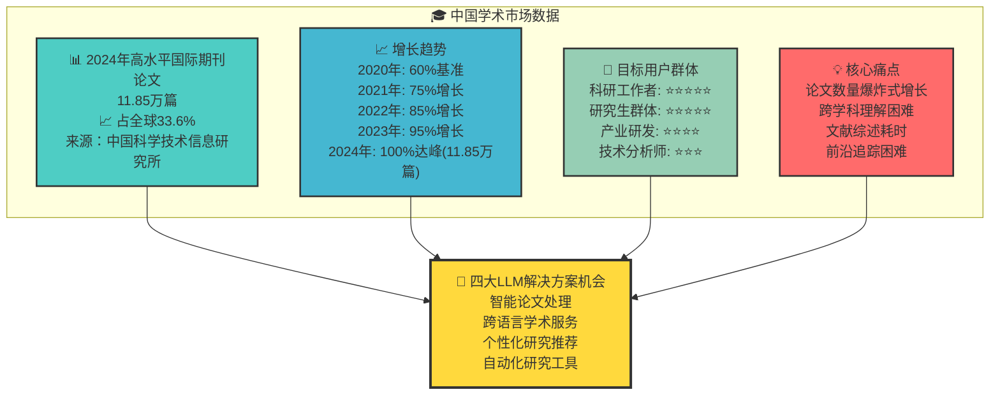

# 中国学术市场LLM机会数据图表

## 图表类型：市场数据展示

## 市场机会评估

### 关键数据指标 (根据记忆中的已验证数据)
- **2024年高水平国际期刊论文**: 11.85万篇
- **占全球比例**: 33.6% 
- **数据来源**: 中国科学技术信息研究所
- **增长趋势**: 持续快速增长

### 用户群体分析
| 用户类型 | 规模特点 | 需求强度 | 付费意愿 |
|----------|----------|----------|----------|
| 科研工作者 | 高校科研院所人员，专业性强 | ⭐⭐⭐⭐⭐ | 高 |
| 研究生群体 | 硕博研究生，学习能力强 | ⭐⭐⭐⭐⭐ | 中等 |
| 产业研发 | 企业技术人员，应用导向 | ⭐⭐⭐⭐ | 高 |
| 技术分析师 | 跟踪技术趋势，广度要求 | ⭐⭐⭐ | 中等 |

### 四大机会方向
1. **📝 智能论文处理** - 自动摘要、要点提取、方法分析
2. **🌐 跨语言学术服务** - 专业翻译、术语解释、文化适配
3. **🎯 个性化研究推荐** - 智能推荐、文献匹配、合作发现
4. **⚡ 自动化研究工具** - 文献综述、引用格式、趋势分析

## 市场优势
✅ **市场规模巨大** - 全球1/3学术产出在中国  
✅ **痛点明确具体** - 论文处理效率普遍难题  
✅ **技术基础成熟** - LLM已具备解决能力  
✅ **付费意愿强** - 研究效率提升有明确价值 