# 混合LLM架构12周开发实现图表

## 图表类型：系统架构 + 时间线

```mermaid
graph TD
    subgraph "混合LLM架构 - 系统设计"
        subgraph "输入层"
            A1["📄 PDF解析"]
            A2["📝 文本预处理"]
        end
        
        subgraph "智能路由层"
            B1["🧠 任务分类"]
            B2["🎯 模块分配"]
        end
        
        subgraph "处理层"
            C1["🔬 专业LLM"]
            C2["🌐 通用LLM"]
            C3["⚙️ 后处理"]
        end
        
        subgraph "输出层"
            D1["📊 结构化结果"]
            D2["⭐ 质量评分"]
        end
        
        A1 --> B1
        A2 --> B1
        B1 --> B2
        B2 --> C1
        B2 --> C2
        C1 --> C3
        C2 --> C3
        C3 --> D1
        C3 --> D2
    end
    
    subgraph "12周开发计划"
        E1["第1-2周<br/>📋 需求细化 + 架构设计<br/>• 详细功能规格定义<br/>• 技术架构确定<br/>• 开发环境搭建"]
        E2["第3-4周<br/>🔧 核心模块开发<br/>• PDF解析模块<br/>• LLM接口封装<br/>• 智能路由逻辑"]
        E3["第5-6周<br/>🎯 专业优化<br/>• 学术文本预处理<br/>• 专业术语识别<br/>• 结果质量评估"]
        E4["第7-12周<br/>🧪 集成测试<br/>• 系统集成联调<br/>• 效果验证测试<br/>• 性能优化调整"]
        
        E1 --> E2 --> E3 --> E4
    end
    
    style A1 fill:#E3F2FD,stroke:#1976D2,stroke-width:2px
    style A2 fill:#E3F2FD,stroke:#1976D2,stroke-width:2px
    style B1 fill:#F3E5F5,stroke:#7B1FA2,stroke-width:2px
    style B2 fill:#F3E5F5,stroke:#7B1FA2,stroke-width:2px
    style C1 fill:#E8F5E8,stroke:#388E3C,stroke-width:2px
    style C2 fill:#E8F5E8,stroke:#388E3C,stroke-width:2px
    style C3 fill:#E8F5E8,stroke:#388E3C,stroke-width:2px
    style D1 fill:#FFF3E0,stroke:#F57C00,stroke-width:2px
    style D2 fill:#FFF3E0,stroke:#F57C00,stroke-width:2px
    style E1 fill:#FFEBEE,stroke:#D32F2F,stroke-width:2px
    style E2 fill:#E8F5E8,stroke:#388E3C,stroke-width:2px
    style E3 fill:#E3F2FD,stroke:#1976D2,stroke-width:2px
    style E4 fill:#FFF3E0,stroke:#F57C00,stroke-width:2px
```

## 🔑 关键技术要点

### 技术实现难点与解决方案
1. **论文格式多样化** → 自适应解析算法
2. **专业术语理解** → 领域知识库辅助  
3. **结果质量控制** → 多维度评估体系

### 核心技术栈
- **PDF解析**: PyPDF2 + pdfplumber
- **文本预处理**: spaCy + 正则表达式
- **LLM接口**: OpenAI API + Anthropic Claude
- **智能路由**: 基于规则 + 机器学习分类
- **后处理**: 自定义算法 + 质量检查

## 开发里程碑
- **Week 2**: 架构设计完成，技术方案确定
- **Week 4**: 核心功能模块开发完成
- **Week 6**: 专业优化算法集成完成
- **Week 8**: 完整系统测试通过，准备上线 