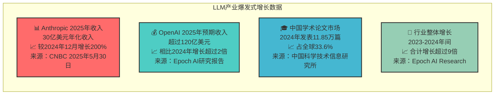

# LLM产业爆发式增长数据图表

## 图表类型：数据卡片展示

## 数据来源链接
- Anthropic收入数据：https://www.cnbc.com/2025/05/30/anthropic-hits-3-billion-in-annualized-revenue-on-business-demand-for-ai.html
- OpenAI收入预测：https://epoch.ai/data-insights/ai-companies-revenue  
- 中国论文统计：http://cpc.people.com.cn/n1/2024/1014/c64387-40338410.html
- 行业增长数据：https://epoch.ai/data-insights/ai-companies-revenue 