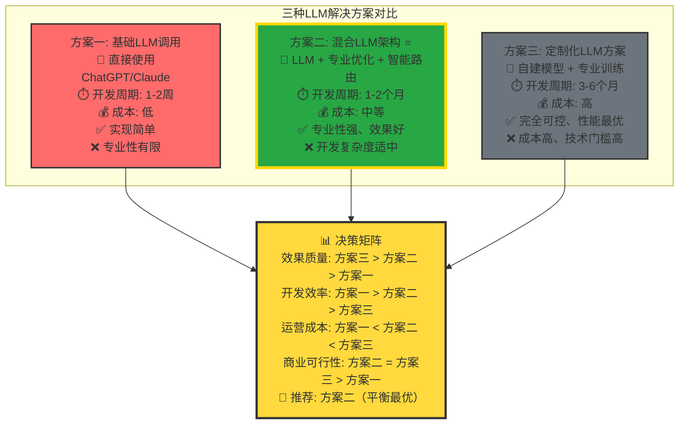

# 三种LLM解决方案全面对比图表

## 图表类型：方案对比分析

## 方案详细对比

### 方案一：基础LLM调用
- **适用场景**: 快速验证、简单需求
- **优势**: 门槛低、成本低、快速上线
- **劣势**: 专业性不足、差异化困难
- **推荐指数**: ⭐⭐ (适合POC)

### 方案二：混合LLM架构 ⭐️ 推荐
- **适用场景**: 商业化产品、专业应用
- **优势**: 效果好、成本可控、技术可行
- **劣势**: 开发周期适中、需要技术积累
- **推荐指数**: ⭐⭐⭐⭐⭐ (最佳平衡)

### 方案三：定制化LLM方案
- **适用场景**: 大规模应用、资源充足
- **优势**: 完全可控、效果最优
- **劣势**: 成本高、周期长、风险大
- **推荐指数**: ⭐⭐⭐ (资源充足时选择)

## 选择建议
> **综合评估：方案二在效果、成本、风险之间达到最佳平衡，是多数情况下的最优选择** 