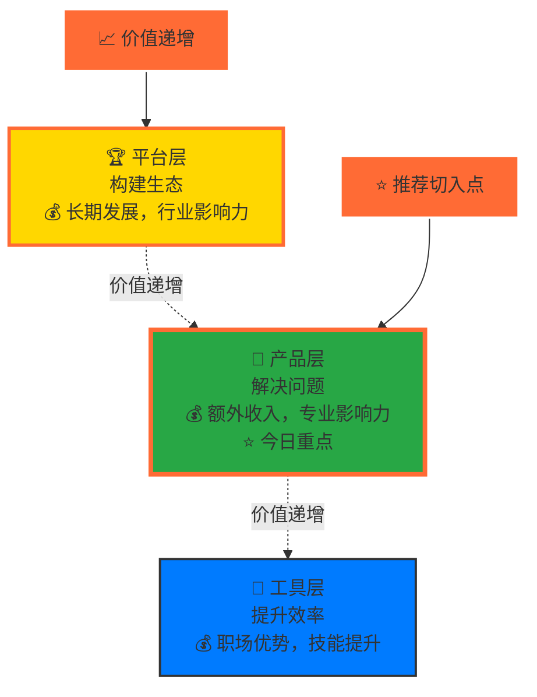

# LLM应用价值三层次金字塔图表

## 图表类型：价值层次递进

```mermaid
graph TD
    A["🏆 平台层<br/>构建生态<br/>💰 长期发展，行业影响力"] 
    B["🎯 产品层<br/>解决问题<br/>💰 额外收入，专业影响力<br/>⭐️ 今日重点"]
    C["🔧 工具层<br/>提升效率<br/>💰 职场优势，技能提升"]
    
    D["📈 价值递增"]
    E["⭐️ 推荐切入点"]
    
    A -.->|"价值递增"| B
    B -.->|"价值递增"| C
    
    D --> A
    E --> B
    
    style A fill:#FFD700,stroke:#FF6B35,stroke-width:3px
    style B fill:#28A745,stroke:#FF6B35,stroke-width:4px
    style C fill:#007BFF,stroke:#333,stroke-width:2px
    style D fill:#FF6B35,stroke:#fff,stroke-width:2px
    style E fill:#FF6B35,stroke:#fff,stroke-width:2px
```

## 设计说明
- **第三层（平台层）**：金色 - 最高价值，长期发展
- **第二层（产品层）**：绿色 + 金色边框 - 今日重点，推荐切入点
- **第一层（工具层）**：蓝色 - 基础层次，入门级别
- **箭头方向**：自下而上，表示价值递增路径 