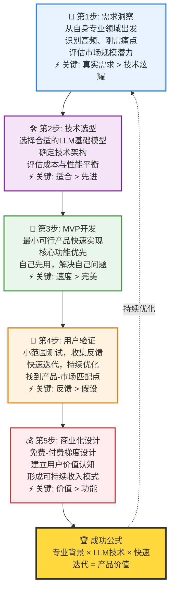

# LLM项目成功方法论五步法图表

## 图表类型：流程方法论

## 三个成功案例的共同要素

✓ **深度理解特定领域痛点** - Leo AI、AudioPen、FormulaBot都从具体问题出发  
✓ **从解决自己的问题开始** - 创始人都是第一用户  
✓ **快速验证，迭代优化** - 小步快跑，持续改进  
✓ **建立可持续商业模式** - 找到用户愿意付费的价值点

## 成功公式解析
**专业背景** × **LLM技术** × **快速迭代** = **产品价值**

- 专业背景：你的领域知识和经验
- LLM技术：AI工具和技术能力  
- 快速迭代：持续学习和优化能力 