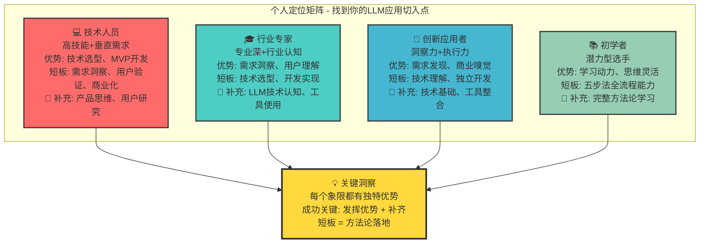

# 个人定位矩阵四象限图表

## 图表类型：四象限分析

## 象限说明
### 象限一：技术人员 (💻)
- **位置**: 高技能 + 垂直需求
- **代表色**: 红色系
- **核心优势**: 技术实现能力强
- **主要短板**: 商业思维和用户洞察

### 象限二：行业专家 (🎓)
- **位置**: 专业深 + 行业认知
- **代表色**: 青色系
- **核心优势**: 深度理解用户需求
- **主要短板**: 技术实现能力

### 象限三：创新应用者 (🚀)
- **位置**: 洞察力 + 执行力
- **代表色**: 蓝色系
- **核心优势**: 市场敏锐度和商业嗅觉
- **主要短板**: 技术深度理解

### 象限四：初学者 (📚)
- **位置**: 潜力型选手
- **代表色**: 绿色系
- **核心优势**: 学习动力和思维灵活性
- **主要短板**: 全面能力需要提升 