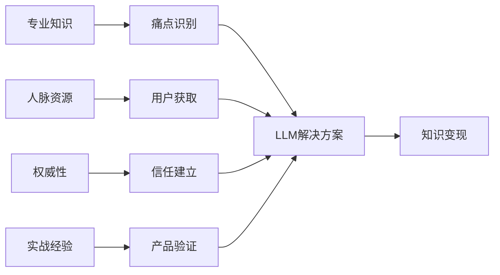

# 🎓 行业专家的LLM知识变现路径

## 🏆 优势识别

作为行业专家，您在LLM应用领域拥有得天独厚的优势：

### 核心优势分析

| 优势维度 | 具体表现 | 变现价值 |
|---------|---------|---------|
| **深度行业知识** | 对特定领域有深刻理解 | 能够识别真实痛点，开发专业解决方案 |
| **丰富人脉资源** | 行业内的影响力和连接 | 拥有天然的用户群体和推广渠道 |
| **专业权威性** | 在专业圈内有认知度和信任 | 更容易获得用户信任和付费意愿 |
| **实战经验丰富** | 知道行业真实痛点和需求 | 确保产品的实用性和市场价值 |

### 优势转化路径

---

## 📈 发展建议

### 1. 结合LLM工具提升服务质量 🚀

**核心理念：** 在现有业务基础上升级服务能力

**实施策略：**
- 🔧 **用LLM优化现有专业服务流程**
  - 自动化重复性的分析工作
  - 提升报告和文档的生成效率
  - 增强数据分析和洞察能力

- 📈 **提高咨询效率和专业度**
  - 利用LLM快速处理信息和研究
  - 提供更深入、更全面的分析
  - 缩短项目交付周期

- ✨ **创造差异化的服务体验**
  - 提供实时的智能答疑服务
  - 个性化的解决方案定制
  - 更直观的可视化呈现

**实际案例：**
- 法律顾问使用LLM辅助合同分析和风险评估
- 财务专家用LLM自动化财报分析和预测
- 医疗专家利用LLM辅助诊断和治疗方案制定

### 2. 探索行业特定的LLM应用 🔍

**核心理念：** 基于行业痛点创新LLM应用场景

**发展路径：**
- 🎯 **基于行业痛点开发专业工具**
  - 识别行业内普遍存在的效率问题
  - 设计针对性的LLM解决方案
  - 验证工具的实际应用效果

- 🚀 **结合LLM技术创新服务模式**
  - 重新定义传统服务的交付方式
  - 探索新的价值创造点
  - 建立可扩展的服务模式

- 🏆 **建立行业LLM应用的标杆**
  - 成为行业内第一批LLM应用者
  - 总结和分享最佳实践
  - 建立行业标准和规范

### 3. 提供LLM应用咨询服务 💡

**核心理念：** 将LLM专业知识转化为咨询产品

**服务内容：**
- 🤝 **帮助同行理解和应用LLM技术**
  - LLM基础知识培训
  - 行业应用场景分析
  - 技术选型和实施指导

- 📋 **提供从技术到商业的完整方案**
  - 需求分析和方案设计
  - 技术实施和集成支持
  - 效果评估和优化建议

- 🌟 **建立LLM应用咨询的专业品牌**
  - 打造个人专家IP
  - 建立口碑和推荐体系
  - 扩大服务影响力

### 4. 建立LLM+专业的个人品牌 👑

**核心理念：** 成为"专业领域+LLM应用"的权威专家

**品牌建设策略：**
- 🎯 **在专业领域成为LLM应用专家**
  - 深入研究LLM在本领域的应用
  - 积累丰富的实践案例
  - 形成独特的方法论

- 📢 **通过分享获得更大影响力**
  - 撰写专业文章和白皮书
  - 参加行业会议和论坛分享
  - 建立专业社群和影响圈

- 🚀 **开拓新的职业发展空间**
  - 成为行业意见领袖
  - 获得更多合作机会
  - 拓展收入来源渠道

---

## 🎯 30天实践计划

### 第一阶段：学习探索期（第1-10天）

**阶段目标：** 掌握LLM工具在专业领域的应用

#### 具体行动计划

**第1-3天：工具调研**
- [ ] 研究ChatGPT、Claude、文心一言等主流LLM工具
- [ ] 测试各工具在专业领域的表现
- [ ] 建立工具使用的初步评估

**第4-6天：案例研究**
- [ ] 收集行业内已有的LLM应用案例
- [ ] 分析成功案例的关键要素
- [ ] 识别可复制的应用模式

**第7-10天：机会识别**
- [ ] 梳理自己日常工作中的重复性任务
- [ ] 评估哪些环节可以用LLM优化
- [ ] 制定初步的应用计划

#### 输出成果
- LLM工具评估报告
- 行业应用案例库
- 个人应用机会清单

### 第二阶段：实践验证期（第11-20天）

**阶段目标：** 在实际工作中验证LLM的应用效果

#### 具体行动计划

**第11-13天：工作流程优化**
- [ ] 选择1-2个具体工作场景进行LLM改造
- [ ] 设计新的工作流程
- [ ] 开始实际应用测试

**第14-17天：效果记录与分析**
- [ ] 详细记录使用过程和效果
- [ ] 对比使用前后的效率变化
- [ ] 收集使用心得和改进建议

**第18-20天：应用扩展**
- [ ] 将成功经验应用到更多场景
- [ ] 探索创新的使用方法
- [ ] 建立个人的LLM应用工具箱

#### 输出成果
- 工作效率提升报告
- LLM应用最佳实践总结
- 个人工具箱和模板库

### 第三阶段：分享传播期（第21-30天）

**阶段目标：** 总结经验，建立专业影响力

#### 具体行动计划

**第21-24天：经验总结**
- [ ] 整理30天的实践经验和数据
- [ ] 提炼可复制的方法论
- [ ] 制作案例分析材料

**第25-27天：内容创作**
- [ ] 撰写专业文章或制作PPT
- [ ] 录制经验分享视频
- [ ] 准备演讲或培训内容

**第28-30天：对外分享**
- [ ] 在专业社群分享经验
- [ ] 发布文章到行业媒体
- [ ] 参加相关会议或论坛

#### 输出成果
- 专业文章或白皮书
- 经验分享视频或PPT
- 行业影响力初步建立

---

## 🔑 成功要素

### 1. 👑 权威认知

**核心要素：** 在行业内建立LLM应用专家形象

**建立策略：**
- **专业度展示**：通过深度内容展现专业能力
- **案例积累**：收集和展示成功应用案例
- **持续输出**：定期分享见解和最新实践
- **同行认可**：获得行业内专家的认可和推荐

**评估指标：**
- 专业文章的阅读量和转发数
- 行业媒体的采访和报道次数
- 同行的邀请和合作机会
- 社交媒体的关注度和互动率

### 2. 🚀 服务创新

**核心要素：** 用LLM重新定义专业服务标准

**创新方向：**
- **服务效率**：大幅提升服务交付速度
- **服务质量**：提供更深入和全面的分析
- **服务体验**：创造更便捷和智能的交互
- **服务价值**：开发新的价值创造点

**创新实践：**
- 建立LLM辅助的工作流程
- 开发智能化的服务工具
- 设计个性化的解决方案
- 创造差异化的竞争优势

### 3. 💎 知识变现

**核心要素：** 将经验转化为可复制的产品或服务

**变现路径：**
- **标准化产品**：将经验包装成标准化的服务产品
- **规模化复制**：建立可规模化的交付模式
- **品牌价值**：通过品牌建设实现溢价
- **生态构建**：建立围绕专业知识的服务生态

**产品形式：**
- 在线课程和培训项目
- 专业工具和模板库
- 咨询服务和实施方案
- 知识付费和会员服务

### 4. 📈 影响力扩展

**核心要素：** 通过LLM应用扩大专业影响力

**扩展策略：**
- **内容营销**：通过优质内容建立影响力
- **社群建设**：构建专业社群和用户基础
- **合作网络**：与行业伙伴建立合作关系
- **媒体曝光**：获得更多的媒体关注和报道

**影响力指标：**
- 专业社群的规模和活跃度
- 行业会议的邀请和演讲机会
- 媒体报道和专访的数量
- 合作伙伴和客户的口碑

---

## 💰 变现模式

### 1. 🎯 咨询服务

**服务内容：** LLM应用咨询和实施指导

**收费模式：**
- **按项目收费**：根据项目复杂度定价，通常5-50万/项目
- **按时间收费**：咨询师时薪500-2000元
- **按效果收费**：根据实施效果分成，通常10-30%

**服务流程：**
1. 需求分析和现状评估
2. 解决方案设计和规划
3. 实施指导和技术支持
4. 效果评估和优化建议

**典型客户：**
- 中大型企业的数字化转型项目
- 专业服务机构的效率提升需求
- 行业协会的技术推广项目

### 2. 📚 培训业务

**培训内容：** 行业LLM应用培训课程

**课程形式：**
- **在线课程**：录播课程，99-999元/课程
- **直播培训**：实时互动，199-1999元/场
- **线下workshop**：深度实战，1999-9999元/人
- **企业内训**：定制化培训，1-10万/天

**课程体系：**
- LLM基础知识和工具使用
- 行业应用场景和最佳实践
- 实战项目和案例分析
- 高级应用和创新探索

### 3. 🔧 工具开发

**合作模式：** 行业专用LLM工具合作开发

**参与方式：**
- **需求定义**：提供行业需求和功能规格
- **产品设计**：参与用户体验和功能设计
- **测试验证**：组织用户测试和效果验证
- **推广应用**：利用行业影响力推广产品

**收益模式：**
- **一次性咨询费**：需求分析和设计咨询，10-100万
- **股权投资**：参与产品股权，获得长期收益
- **推广分成**：推广成功按销售额分成，通常5-20%
- **品牌合作**：品牌授权和联合推广

### 4. 📝 内容变现

**内容形式：** 专业内容创作和知识付费

**变现渠道：**
- **专业文章**：行业媒体付费专栏，1000-10000元/篇
- **知识付费**：在线课程和专栏，年收入10-100万
- **出版图书**：专业书籍出版，版税5-15%
- **会员服务**：专业社群会员，199-1999元/年

**内容策略：**
- 建立内容创作计划和发布节奏
- 打造个人IP和专业品牌
- 建立多渠道的内容分发网络
- 构建用户社群和互动体系

---

## 🚀 长期发展路径

### 阶段一：个人专家（1-6个月）
- 建立LLM应用的专业能力
- 在工作中验证应用效果
- 开始对外分享经验和见解

### 阶段二：行业意见领袖（6-18个月）
- 建立行业内的专业声誉
- 开展咨询和培训业务
- 参与行业标准和规范制定

### 阶段三：生态构建者（18个月以上）
- 建立专业服务生态系统
- 孵化相关产品和服务
- 成为行业发展的推动者

---

## 💡 成功案例启发

### 案例1：法律行业LLM专家
**背景：** 资深律师，专精企业法务
**转型路径：** 法律文档分析 → LLM工具应用 → 法律科技咨询
**成果：** 年收入增长300%，成为法律科技意见领袖

### 案例2：财务分析专家
**背景：** 注册会计师，擅长财务分析
**转型路径：** 财报自动化 → LLM财务工具 → 企业财务数字化咨询
**成果：** 服务效率提升5倍，客户数量增长10倍

### 案例3：医疗健康顾问
**背景：** 主任医师，临床经验丰富
**转型路径：** 诊断辅助 → 医疗LLM应用 → 智慧医疗咨询
**成果：** 开发专业工具，获得千万级投资

---

> 🌟 **记住：** 作为行业专家，您最大的优势是深厚的专业知识和行业影响力。将这些优势与LLM技术相结合，不仅能够提升自身的服务能力，更能够开创全新的商业机会。关键是要保持开放的心态，积极探索和实践，将专业知识转化为可持续的商业价值。 