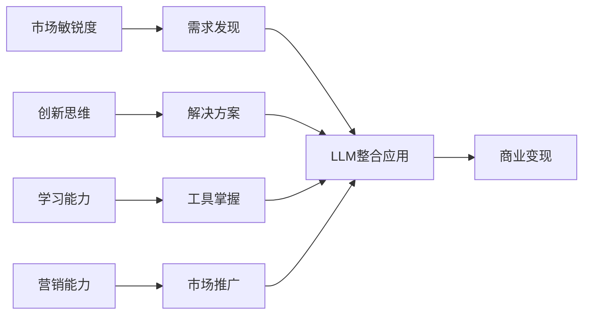

# 🎨 创新应用者的LLM整合营销路径

## 🏆 优势识别

创新应用者在LLM变现领域具有独特的竞争优势：

### 核心优势分析

| 优势维度 | 具体表现 | 变现价值 |
|---------|---------|---------|
| **敏锐的市场嗅觉** | 能够发现未被满足的需求 | 找到蓝海市场，避开红海竞争 |
| **创新思维能力** | 善于组合现有资源创造新价值 | 低成本创新，快速试错验证 |
| **快速学习能力** | 能够快速掌握新工具和方法 | 紧跟技术趋势，抢占先机 |
| **营销传播能力** | 懂得如何包装和推广产品 | 有效获客，建立品牌影响力 |

### 创新应用者的价值定位



---

## 📈 发展建议

### 1. 发现未被满足的细分需求 🔍

**核心理念：** 在大众化的LLM应用中寻找细分机会

**发现策略：**
- 🎯 **关注生活和工作中的小痛点**
  - 观察日常工作中的重复性任务
  - 记录朋友圈的抱怨和需求
  - 分析论坛、社群的讨论热点
  - 注意传统行业的数字化空白

- 👥 **寻找被忽视的用户群体**
  - 小众职业群体的专业需求
  - 年龄段偏向的特殊需求
  - 地域性的文化和语言需求
  - 特定场景下的临时性需求

- 🌐 **挖掘跨行业的需求共性**
  - 不同行业的相似痛点
  - 可复用的工作流程模式
  - 通用的信息处理需求
  - 标准化的服务流程

**实际案例：**
- **AudioPen**: 发现语音转文字+优化的细分需求
- **FormulaBot**: 抓住Excel公式生成的痛点需求
- **Leo AI**: 针对教师群体的专业辅助需求

### 2. 整合现有LLM工具解决问题 🔧

**核心理念：** 不做技术开发者，做工具整合者

**整合思路：**
- 🛠️ **不需要自己开发技术**
  - 充分利用现有的成熟LLM API
  - 组合多个工具的最佳功能
  - 专注于用户体验优化
  - 建立简化的操作流程

- 🎨 **巧妙组合多个工具的功能**
  - GPT-4的逻辑分析能力
  - Claude的长文本处理能力
  - Midjourney的图像生成能力
  - 各种专业工具的特殊功能

- ✨ **创造独特的用户体验**
  - 简化复杂的操作流程
  - 提供一站式解决方案
  - 优化结果输出格式
  - 建立个性化服务流程

**整合示例：**
```
输入处理 → LLM分析 → 结果优化 → 格式输出
    ↓         ↓         ↓         ↓
语音识别   GPT-4   Claude优化   专业模板
```

### 3. 通过内容营销获得用户 📢

**核心理念：** 让产品自己说话，用效果吸引用户

**营销策略：**
- 🎬 **制作高质量的演示内容**
  - 真实使用场景的demo视频
  - 前后对比效果展示
  - 操作流程的详细教程
  - 用户成功案例分享

- 📚 **分享使用经验和技巧**
  - 工具使用的最佳实践
  - 常见问题的解决方案
  - 进阶技巧和隐藏功能
  - 行业应用的专业见解

- 👥 **建立用户社群和口碑**
  - 创建专业交流群组
  - 组织线上线下活动
  - 建立用户反馈机制
  - 培养核心用户群体

**内容营销漏斗：**
```
吸引关注 → 建立信任 → 试用体验 → 付费转化 → 推荐传播
```

### 4. 建立社群和影响力 👑

**核心理念：** 从产品销售者转变为社群领导者

**影响力建设：**
- 🎯 **聚集有相同需求的用户**
  - 识别目标用户画像
  - 建立专业交流平台
  - 提供持续价值输出
  - 创造用户间的连接

- 📈 **成为细分领域的意见领袖**
  - 深入研究专业领域
  - 发表有价值的观点
  - 参与行业讨论和辩论
  - 建立专业权威形象

- 💰 **通过影响力变现**
  - 付费咨询和指导服务
  - 高端产品和会员服务
  - 品牌合作和广告收入
  - 培训课程和知识付费

---

## 🎯 30天实验计划

### 第一阶段：市场调研期（第1-10天）

**阶段目标：** 发现真实的市场需求和机会

#### 具体行动计划

**第1-3天：用户调研**
- [ ] 确定目标用户群体（职业、年龄、场景）
- [ ] 设计用户访谈问题清单
- [ ] 进行5-10个用户深度访谈
- [ ] 收集用户真实痛点和需求

**第4-6天：竞品分析**
- [ ] 调研现有解决方案的优缺点
- [ ] 分析竞品的定价和商业模式
- [ ] 识别市场空白和改进机会
- [ ] 评估自己的差异化优势

**第7-10天：机会评估**
- [ ] 评估不同LLM工具的适用性
- [ ] 设计初步的解决方案框架
- [ ] 估算开发成本和时间投入
- [ ] 制定MVP的功能需求清单

#### 输出成果
- 用户需求调研报告
- 竞品分析报告
- 商业机会评估文档
- MVP产品规划方案

### 第二阶段：工具测试期（第11-20天）

**阶段目标：** 验证技术可行性和用户体验

#### 具体行动计划

**第11-13天：工具组合测试**
- [ ] 测试不同LLM工具的组合效果
- [ ] 设计工具间的数据流转方式
- [ ] 优化处理速度和准确性
- [ ] 建立错误处理和容错机制

**第14-17天：用户流程设计**
- [ ] 设计完整的用户使用流程
- [ ] 优化用户界面和交互体验
- [ ] 建立用户引导和帮助系统
- [ ] 测试不同用户场景的适用性

**第18-20天：效果验证**
- [ ] 邀请种子用户试用测试
- [ ] 收集详细的使用反馈
- [ ] 分析效果数据和改进建议
- [ ] 优化产品功能和用户体验

#### 输出成果
- 技术方案验证报告
- 用户体验测试报告
- 产品迭代优化方案
- 种子用户反馈总结

### 第三阶段：产品验证期（第21-30天）

**阶段目标：** 制作可演示的产品原型

#### 具体行动计划

**第21-24天：Demo制作**
- [ ] 制作产品演示视频
- [ ] 准备使用案例和效果展示
- [ ] 设计产品介绍和宣传材料
- [ ] 建立简单的产品着陆页

**第25-27天：用户验证**
- [ ] 邀请目标用户试用demo
- [ ] 收集用户的真实反馈和建议
- [ ] 测试用户的付费意愿和价格敏感度
- [ ] 分析用户转化和留存数据

**第28-30天：商业验证**
- [ ] 根据反馈优化产品和定价
- [ ] 制定正式的商业计划
- [ ] 设计营销推广策略
- [ ] 准备产品正式发布

#### 输出成果
- 产品Demo和演示材料
- 用户验证报告
- 商业模式验证文档
- 正式发布计划

---

## 🔑 成功要素

### 1. 🔍 需求洞察

**核心要素：** 发现别人没发现的真实机会

**洞察方法：**
- **深度用户研究**：通过用户访谈了解真实需求
- **数据驱动分析**：用数据验证市场机会大小
- **趋势预判能力**：提前布局未来需求方向
- **痛点敏感度**：对细微痛点有敏锐感知

**评估指标：**
- 用户愿意为解决方案付费的比例
- 现有解决方案的满意度评分
- 目标市场的规模和增长潜力
- 竞争对手的数量和实力

### 2. 🔧 整合能力

**核心要素：** 不一定要技术开发，重在资源整合

**整合维度：**
- **工具整合**：组合多个LLM工具的最佳功能
- **流程整合**：优化从输入到输出的完整流程
- **资源整合**：整合内容、渠道、用户等资源
- **价值整合**：将分散的价值点组合成完整方案

**整合策略：**
- 专注于用户体验而非技术实现
- 建立标准化的服务流程
- 创造独特的价值组合
- 保持灵活的技术架构

### 3. 📢 营销能力

**核心要素：** 将产品有效推向目标市场

**营销要点：**
- **内容营销**：通过优质内容建立信任和权威
- **社群营销**：在目标用户聚集的地方建立影响
- **口碑营销**：让满意用户成为最好的推广者
- **效果营销**：用真实效果说话，数据驱动决策

**营销渠道：**
- 专业社交媒体平台
- 行业垂直媒体和论坛
- 线上线下活动和会议
- KOL合作和品牌联名

### 4. 👥 社群运营

**核心要素：** 建立用户粘性和持续价值

**运营策略：**
- **价值输出**：持续提供有价值的内容和服务
- **用户互动**：促进用户间的交流和协作
- **反馈循环**：建立用户反馈和产品迭代的良性循环
- **生态建设**：围绕核心产品建立服务生态

**运营指标：**
- 用户活跃度和参与度
- 用户留存率和复购率
- 用户推荐率和口碑评分
- 社群规模和影响力扩展

---

## 💡 整合策略示例

### 1. 🔗 工具链整合

**策略说明：** 多个LLM工具的串联使用

**实施步骤：**
1. **输入处理**：语音识别 + 文本清洗
2. **内容分析**：GPT-4逻辑分析 + Claude语言优化
3. **结果生成**：专业模板 + 格式化输出
4. **质量控制**：人工审核 + 自动检测

**应用场景：**
- 会议记录自动生成和优化
- 学术论文的智能分析和总结
- 商业报告的自动化制作
- 多语言内容的翻译和本地化

**商业价值：**
- 大幅提升工作效率（5-10倍）
- 保证输出质量的一致性
- 降低专业服务的门槛
- 创造可规模化的服务模式

### 2. 📦 服务包装

**策略说明：** 将LLM能力包装为完整服务

**包装思路：**
- **问题定义**：将复杂技术转化为业务语言
- **解决方案**：提供端到端的完整服务
- **价值承诺**：明确输出结果和质量标准
- **服务保障**：建立质量保证和售后支持

**服务模式：**
- **标准化服务**：固定流程，批量处理
- **定制化服务**：个性需求，专属方案
- **订阅制服务**：持续服务，长期合作
- **平台化服务**：自助服务，按需付费

### 3. 📝 内容+工具

**策略说明：** 结合内容创作和工具推荐

**组合模式：**
- **教程内容**：如何使用LLM工具的专业指导
- **案例分析**：成功应用的详细案例分享
- **工具评测**：客观评价不同工具的优缺点
- **最佳实践**：总结和分享使用经验技巧

**变现路径：**
- **内容付费**：高质量内容的直接销售
- **工具分成**：推荐工具的佣金收入
- **咨询服务**：基于内容的专业咨询
- **培训课程**：系统化的技能培训

### 4. 💰 社群+变现

**策略说明：** 通过社群运营实现商业变现

**社群价值：**
- **知识分享**：专业知识和经验的交流平台
- **资源对接**：用户间的资源共享和合作
- **问题解答**：专家答疑和技术支持
- **趋势洞察**：行业动态和发展趋势分析

**变现模式：**
- **会员费用**：高质量社群的入群费用
- **增值服务**：专属服务和VIP待遇
- **商业合作**：品牌合作和广告收入
- **活动收入**：线上线下活动的票务收入

---

## 🌟 成功案例启发

### AudioPen模式深度分析

**案例背景：** Louis Pereira的AudioPen在2个月内实现$73,000收入

#### 成功要素分析

**1. 个人痛点驱动**
- **真实需求**：创始人自己遇到的真实问题
- **使用频次**：日常工作中的高频需求
- **解决效果**：显著提升工作效率和体验
- **用户共鸣**：很多人有相同的痛点

**2. 工具整合创新**
- **技术组合**：语音识别 + GPT文本优化
- **流程优化**：一键式操作，极简用户体验
- **质量提升**：AI优化后的文本质量更高
- **效率提升**：相比传统方式效率提升10倍

**3. 意外的市场发现**
- **目标用户**：原本面向个人用户
- **实际用户**：企业和专业人士成为主要用户
- **使用场景**：会议记录、采访整理、内容创作
- **付费意愿**：用户愿意为效率提升付费

#### 商业模式洞察

**定价策略：**
- **免费版本**：基础功能，吸引用户试用
- **付费版本**：高级功能，月费$10-30
- **企业版本**：团队功能，年费$500-2000

**增长策略：**
- **产品自传播**：优质体验带来自然推荐
- **社交媒体**：Twitter、LinkedIn的有机传播
- **内容营销**：使用教程和案例分享
- **口碑效应**：用户主动分享使用体验

#### 可复制的成功模式

**1. 发现真需求**
- 从自己的痛点出发
- 验证需求的普遍性
- 评估用户的付费意愿
- 分析现有解决方案的不足

**2. 简单的整合**
- 不需要复杂的技术开发
- 重在工具的巧妙组合
- 专注于用户体验优化
- 保持产品的简洁性

**3. 快速验证和迭代**
- 最小可行产品（MVP）快速上线
- 收集用户反馈持续改进
- 根据数据调整产品方向
- 保持敏捷的开发节奏

**4. 有机增长**
- 让产品本身成为最好的营销
- 通过用户口碑实现自然传播
- 建立用户社群和生态
- 保持与用户的密切沟通

### 关键成功启示

#### 🚀 核心洞察

> **简单的工具组合 + 精准的需求定位 = 爆发式增长**

#### 实践指导

1. **从小处着手**：不要试图解决所有问题，专注一个痛点
2. **快速验证**：用最小成本验证想法的可行性
3. **用户导向**：让用户体验驱动产品设计和迭代
4. **保持简单**：简单易用比功能复杂更重要
5. **持续改进**：根据用户反馈不断优化和完善

#### 避免的陷阱

1. **技术导向**：不要因为技术可行就认为有市场需求
2. **功能堆叠**：不要为了差异化而增加不必要的复杂性
3. **忽视营销**：好产品也需要有效的市场推广
4. **过度设计**：不要在早期就追求完美的产品设计

---

## 🎯 行动指南

### 立即开始的5个步骤

1. **📝 记录痛点**：开始记录自己和身边人的日常痛点
2. **🔍 市场调研**：选择一个痛点进行深入的用户调研
3. **🛠️ 工具测试**：尝试用现有LLM工具组合解决这个痛点
4. **👥 寻找用户**：找到有相同痛点的潜在用户群体
5. **🚀 制作MVP**：制作最简单的解决方案原型

### 长期发展路径

**阶段一：个人验证（1-3个月）**
- 验证个人痛点的普遍性
- 测试工具组合的可行性
- 收集初步的用户反馈

**阶段二：产品优化（3-6个月）**
- 根据反馈优化产品功能
- 建立稳定的用户群体
- 验证商业模式的可行性

**阶段三：规模扩展（6-12个月）**
- 扩大用户规模和市场影响
- 建立完善的服务体系
- 探索新的增长机会

**阶段四：生态建设（12个月以上）**
- 建立完整的产品生态
- 拓展相关业务和服务
- 成为细分领域的领导者

---

> 🌟 **记住：** 创新不一定要从技术开始，更多时候是从用户需求开始。作为创新应用者，你的优势在于敏锐的市场洞察和快速的行动能力。通过巧妙整合现有工具，专注于解决真实问题，你就能在LLM变现的道路上找到属于自己的成功模式。 