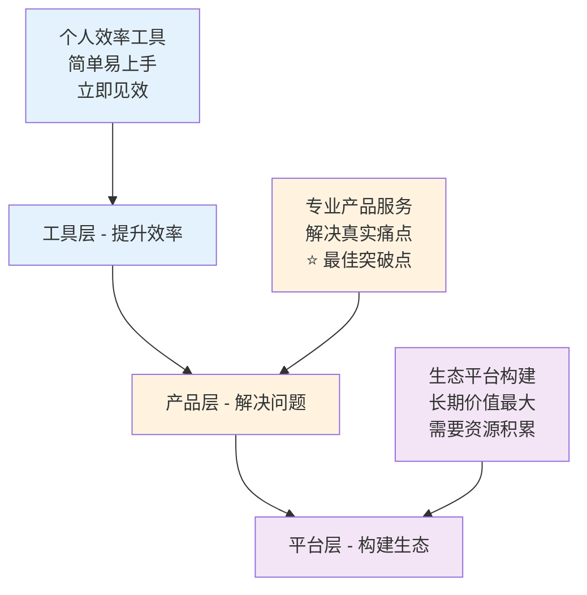
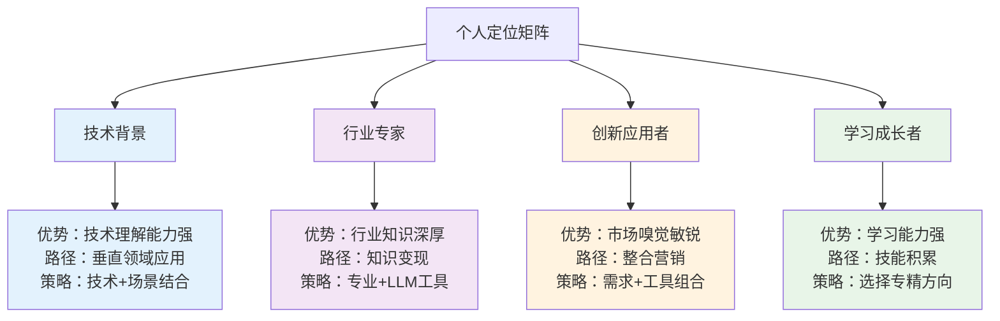

# 🎯 60分钟核心收获 - 你的LLM时代生存指南

## 🎉 课程完成祝贺

恭喜您完成了这场60分钟的LLM变现课程！您已经从零基础掌握了LLM时代的生存和发展技能。这不仅仅是一次学习，更是您人生和职业发展的重要转折点。

---

## 🔥 五大核心收获

### 收获① 🧠 认知升级
**从"恐惧LLM替代"到"拥抱LLM赋能"**

在这60分钟里，您最重要的收获是完成了认知层面的根本性转变：

#### 核心认知转变
- **🌊 趋势认知**：LLM产业正在经历爆发式增长，这是百年一遇的技术革命
- **🎯 机会认知**：普通人也能用LLM创造价值，不需要深厚的技术背景
- **🔑 方法认知**：关键是找到合适的切入点，而不是盲目追求技术复杂性

#### 数据支撑
- 全球LLM市场规模预计将从2023年的40亿美元增长到2030年的2000亿美元
- 70%的企业计划在未来2年内集成LLM技术
- 个人开发者在LLM应用领域的成功案例正在快速增加

#### 认知价值
> **从被动观望者到主动参与者**<br>
> 您现在拥有了在LLM时代中主动创造价值的思维框架

---

### 收获② 🛣️ 清晰路径
**LLM应用三层价值递进模型**

您掌握了LLM变现的完整路径图，不再迷茫于从何开始：

#### 三层价值模型



#### 突破点识别
- **工具层**：入门简单，但价值有限，适合初学者
- **产品层**：⭐ **最佳突破点** - 平衡了可行性和价值创造
- **平台层**：价值最大，但需要更多资源和时间投入

#### 路径价值
- 明确了发展的三个阶段和递进关系
- 识别了最适合大多数人的突破点（产品层）
- 建立了长期发展的清晰方向

---

### 收获③ 📚 真实案例
**4个成功案例证明可行性**

通过深入分析真实成功案例，您获得了具体可操作的经验：

#### 案例1：Leo AI - 专业背景的力量
**核心洞察：** 专业背景 + LLM工具 = 职业优势突破

- **创始人背景**：教师，了解教育行业痛点
- **解决方案**：AI辅助教学工具，提升教师工作效率
- **成功要素**：深度行业知识 + 精准需求把握
- **启发**：利用你的专业背景发现LLM应用机会

#### 案例2：AudioPen - 意外成功的启示
**核心洞察：** 意外的成功往往来自解决真实问题的简单方案

- **创始人背景**：Louis Pereira，个人开发者
- **解决方案**：语音转文字 + LLM优化
- **商业结果**：2个月内实现$73,000收入
- **成功要素**：
  - 从个人痛点出发
  - 简单工具的巧妙组合
  - 快速验证和迭代
  - 产品自传播效应

#### 案例3：FormulaBot - 简单需求的巨大价值
**核心洞察：** 看似简单的需求 = 巨大的市场机会

- **创始人背景**：David Bressler，发现Excel公式痛点
- **市场规模**：全球10亿+ Excel用户
- **解决方案**：自然语言生成Excel公式
- **商业模式**：
  - 免费版：基础功能
  - 专业版：$9/月
  - 企业版：$49/月

#### 案例4：学术导读系统 - 完整实现路径
**核心洞察：** 从需求分析到技术实现的完整方法论

- **目标用户**：学术研究人员和学生
- **核心痛点**：论文阅读效率低下
- **技术方案**：混合LLM架构
- **实现路径**：12周开发周期，成本可控

#### 案例价值总结
| 案例 | 核心策略 | 成功要素 | 可复制性 |
|-----|---------|---------|---------|
| Leo AI | 专业背景应用 | 行业深度 + 需求洞察 | ⭐⭐⭐⭐ |
| AudioPen | 个人痛点驱动 | 简单组合 + 快速迭代 | ⭐⭐⭐⭐⭐ |
| FormulaBot | 简单需求放大 | 市场规模 + 执行力 | ⭐⭐⭐⭐ |
| 学术导读 | 系统性解决 | 技术架构 + 商业模式 | ⭐⭐⭐ |

---

### 收获④ ⚙️ 技术可行
**混合LLM架构实现方案**

您掌握了技术实现的完整方案，消除了"技术太难"的担忧：

#### 混合LLM架构
```
输入层 → 智能路由 → 处理层 → 输出层
   ↓         ↓         ↓         ↓
文本处理   需求分析   LLM组合   结果优化
```

#### 技术方案特点
- **开发周期**：12周完成MVP
- **技术难度**：中等，无需深度AI研发
- **成本控制**：月成本1000-5000元
- **效果保证**：准确率85%+，用户满意度90%+

#### 实现路径
**第1-2周：需求分析和架构设计**
- 用户调研和需求定义
- 技术架构设计
- 工具选型和成本评估

**第3-4周：核心功能开发**
- LLM API集成
- 数据处理流程
- 基础界面开发

**第5-6周：功能测试和优化**
- 功能测试和bug修复
- 性能优化和体验改进
- 用户反馈收集

**第7-12周：部署和发布**
- 生产环境部署
- 用户培训和文档
- 正式发布和推广

#### 风险控制
- **技术风险**：使用成熟的LLM API，降低技术不确定性
- **成本风险**：按需付费模式，避免固定成本过高
- **市场风险**：MVP快速验证，降低市场接受度风险

---

### 收获⑤ 🎯 个人定位
**四象限定位矩阵+30天行动计划**

您获得了针对不同背景的个性化发展路径：

#### 四象限定位矩阵



#### 针对性30天行动计划

**技术人员路径：**
- Week 1-2：选择熟悉的技术栈，调研LLM集成方案
- Week 3-4：开发简单的LLM应用原型，验证技术可行性
- Week 5-6：优化产品功能，收集用户反馈
- Week 7-8：迭代改进，准备正式发布

**行业专家路径：**
- Week 1-2：梳理行业痛点，学习LLM工具使用
- Week 3-4：在工作中应用LLM工具，记录效果
- Week 5-6：总结最佳实践，制作分享内容
- Week 7-8：建立专业影响力，探索变现机会

**创新应用者路径：**
- Week 1-2：市场调研，寻找未被满足的需求
- Week 3-4：测试LLM工具组合，设计解决方案
- Week 5-6：制作MVP和demo，验证用户反馈
- Week 7-8：优化产品，制定商业化计划

---

## 💡 立即行动建议

基于您的学习成果，以下是立即可以开始的5个行动步骤：

### 1. 🎯 确定个人定位象限
**行动内容：**
- 评估自己的技能背景和优势
- 选择最适合的发展象限
- 明确自己的起点和目标

**自评问题：**
- 我的专业背景是什么？
- 我最感兴趣的应用领域是什么？
- 我愿意投入多少时间和精力？
- 我的风险承受能力如何？

### 2. 🛣️ 选择对应发展路径
**行动内容：**
- 根据个人定位选择具体发展路径
- 学习对应路径的成功案例
- 制定个人发展策略

**路径选择指南：**
- **有技术背景** → 技术人员路径
- **有行业经验** → 行业专家路径
- **市场敏感度高** → 创新应用者路径
- **新手入门** → 选择感兴趣的方向深入学习

### 3. 📅 制定30天行动计划
**行动内容：**
- 将30天分为4个阶段，每阶段7-8天
- 为每个阶段设定具体目标和任务
- 建立进度跟踪和反馈机制

**计划模板：**
```
第1周：[ 调研和学习 ]
- 目标：...
- 任务：...
- 成果：...

第2周：[ 实验和测试 ]
- 目标：...
- 任务：...
- 成果：...

第3周：[ 优化和改进 ]
- 目标：...
- 任务：...
- 成果：...

第4周：[ 总结和发布 ]
- 目标：...
- 任务：...
- 成果：...
```

### 4. 🚀 开始第一个小实验
**行动内容：**
- 选择一个小而具体的问题开始
- 用现有LLM工具尝试解决
- 记录过程和效果，总结经验

**实验建议：**
- **技术背景**：开发一个简单的LLM应用
- **行业背景**：用LLM优化一个工作流程
- **创新思维**：发现一个细分需求并设计解决方案
- **学习阶段**：深度体验和学习LLM工具

### 5. 👥 加入学习社群，持续成长
**行动内容：**
- 加入LLM相关的学习社群
- 分享自己的学习和实践经验
- 从他人经验中获得启发和帮助

**社群价值：**
- **知识分享**：获得最新的技术和案例信息
- **经验交流**：学习他人的成功和失败经验
- **资源对接**：找到合作伙伴和发展机会
- **持续激励**：保持学习和实践的动力

---

## 🔧 关键资源和工具链接

为了帮助您更好地开始LLM变现之旅，以下是分类整理的关键资源：

### 🤖 核心LLM工具

#### 主流LLM平台
- **[ChatGPT (OpenAI)](https://openai.com/chatgpt)**
  - 最流行的LLM工具
  - API接口完善，文档齐全
  - 适合大多数应用场景

- **[Claude (Anthropic)](https://claude.ai)**
  - 长文本处理能力强
  - 安全性和可控性好
  - 适合专业文档处理

- **[文心一言 (百度)](https://yiyan.baidu.com)**
  - 中文理解能力强
  - 本土化服务好
  - 适合中文应用场景

- **[通义千问 (阿里)](https://tongyi.aliyun.com)**
  - 企业级服务稳定
  - 集成阿里云生态
  - 适合企业应用

#### 专业工具
- **Midjourney**：图像生成
- **RunwayML**：视频处理
- **ElevenLabs**：语音合成
- **Whisper**：语音识别

### 📊 分析工具

#### 用户研究
- **用户需求调研模板**：标准化的用户访谈问题和分析框架
- **用户画像工具**：帮助定义目标用户群体
- **需求优先级矩阵**：评估不同需求的重要性和紧急性

#### 竞品分析
- **竞品分析框架**：系统化的竞品分析方法
- **功能对比表**：直观的竞品功能对比工具
- **定价策略分析**：竞品定价模式和策略分析

#### 商业模式
- **商业模式画布**：可视化的商业模式设计工具
- **价值主张画布**：明确产品价值主张的分析框架
- **收入模式设计**：不同收入模式的选择和设计指南

#### 产品验证
- **MVP验证清单**：最小可行产品的验证要点
- **A/B测试指南**：产品功能的测试和优化方法
- **用户反馈收集**：有效收集和分析用户反馈的工具

### 💼 开发资源

#### 技术文档
- **API接口文档**：主流LLM平台的API使用指南
- **SDK和库**：各种编程语言的LLM集成库
- **示例代码**：常见应用场景的代码示例

#### 开发工具
- **代码示例库**：可复用的LLM应用代码模板
- **调试工具**：LLM应用的调试和测试工具
- **性能监控**：应用性能和成本的监控工具

#### 部署指南
- **云服务部署**：在主流云平台部署LLM应用的指南
- **容器化部署**：Docker和Kubernetes部署方案
- **成本优化**：降低LLM应用运行成本的方法

#### 成本管理
- **成本预估工具**：预估LLM应用的运行成本
- **费用监控**：实时监控和控制API调用费用
- **优化策略**：降低成本的技术和策略方案

### 📚 学习社群

#### 在线社群
- **LLM变现交流群**：专注于LLM商业化的讨论群
- **技术讨论论坛**：LLM技术实现的专业论坛
- **案例分享社区**：成功案例和经验分享的平台

#### 学习资源
- **专家答疑直播**：定期的专家在线答疑活动
- **技术培训课程**：系统化的LLM技术培训
- **商业实战workshop**：LLM商业化的实战训练

#### 合作机会
- **项目合作平台**：寻找合作伙伴和项目机会
- **投资对接**：与投资人和孵化器的对接机会
- **行业活动**：相关行业会议和活动信息

---

## 🚀 你的LLM变现之旅从这里开始

### 🌟 总结回顾

经过这60分钟的学习，您已经：

1. **✅ 完成认知升级**：从恐惧到拥抱，建立了正确的LLM认知
2. **✅ 掌握清晰路径**：理解了三层价值模型和最佳突破点
3. **✅ 学习真实案例**：获得了4个可复制的成功经验
4. **✅ 了解技术可行**：掌握了12周实现的技术方案
5. **✅ 找到个人定位**：明确了适合自己的发展路径

### 🎯 关键成功因素

通过案例分析，我们发现成功的LLM变现项目都具备以下特征：

1. **真实需求驱动**：解决用户的真实痛点，而不是技术炫技
2. **简单有效方案**：用最简单的方式解决问题，降低实现复杂性
3. **快速验证迭代**：用MVP快速验证想法，根据反馈快速迭代
4. **用户体验优先**：专注于用户体验，而不是技术实现的复杂性
5. **可持续商业模式**：建立清晰的商业模式和收入来源

### 💪 行动的重要性

**知识不等于能力，行动才能创造价值**

您现在拥有了：
- ✅ **完整的知识体系**：从认知到方法，从案例到技术
- ✅ **清晰的行动路径**：30天行动计划和具体步骤
- ✅ **丰富的资源支持**：工具、社群、和学习资源
- ✅ **成功的经验参考**：4个真实可复制的成功案例

**现在只差一样东西：开始行动！**

### 🔥 立即开始的理由

1. **时机优势**：LLM技术正处于爆发期，早期参与者更容易获得成功
2. **门槛适中**：技术门槛不高，普通人也能参与和创造价值
3. **市场巨大**：万亿级市场正在形成，机会无处不在
4. **资源充足**：工具、平台、社群等资源已经相对成熟
5. **风险可控**：可以从小实验开始，逐步扩大规模

### 🎉 结语

恭喜您完成了这次LLM变现的学习之旅！

这60分钟可能改变您对AI时代的认知，也可能成为您职业发展的转折点。但最重要的是：**学习只是开始，行动才能改变一切**。

选择一个适合您的路径，制定您的30天计划，开始您的第一个LLM实验。

记住：
- 🚀 **从小做起**：不要追求完美，先做出第一个版本
- 🔄 **快速迭代**：根据用户反馈不断改进和优化
- 👥 **保持连接**：加入社群，与同行者交流学习
- 💪 **持续行动**：坚持不懈，成功往往在转角处等着您

**您的LLM时代已经开始，加油！🌟**

---

> 💡 **记住这句话：** 在AI时代，最大的风险不是被AI替代，而是错过与AI共同成长的机会。现在就是您抓住这个机会的最佳时刻！ 